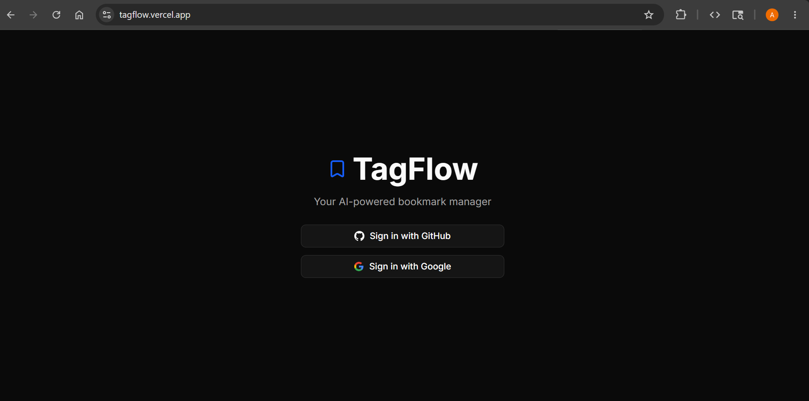
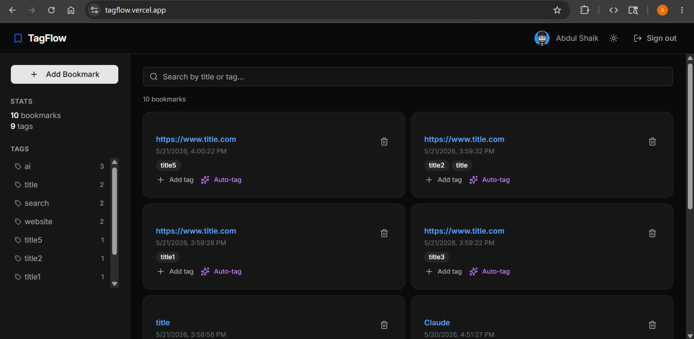

# TagFlow

> Save a link. AI tags it. Find it later.

**[Live Demo](https://tagflow.vercel.app)**




Browser bookmarks are broken - folders force one category, search barely works.
TagFlow lets you dump a link and have AI figure out the tags.

## Stack
`Next.js` · `TypeScript` · `PostgreSQL` · `Supabase` · `Prisma` · `NextAuth` · `Groq` · `shadcn/ui`

## Features
- GitHub OAuth login
- AI auto-tagging via Groq on every saved link
- Manual tag editing
- Instant client-side search by title or tag
- Click any tag to filter

## Setup

```bash
git clone https://github.com/AbdulShaikz/tagflow
cd tagflow
pnpm install
cp .env.example .env   # fill in DATABASE_URL, GITHUB_*, GROQ_API_KEY, NEXTAUTH_*
npx prisma db push
pnpm dev
```

## Trade-offs
- **Groq over OpenAI** - free tier, faster latency, tags are slightly less nuanced
- **Client-side search** - simple and fast enough at personal scale, would swap to Postgres full-text search for multi-user
- **`prisma db push` not migrations** - fine for solo dev, migrations needed before 
  production users